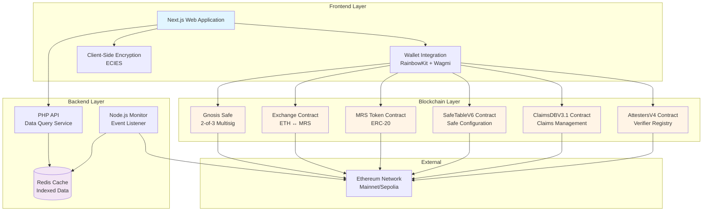
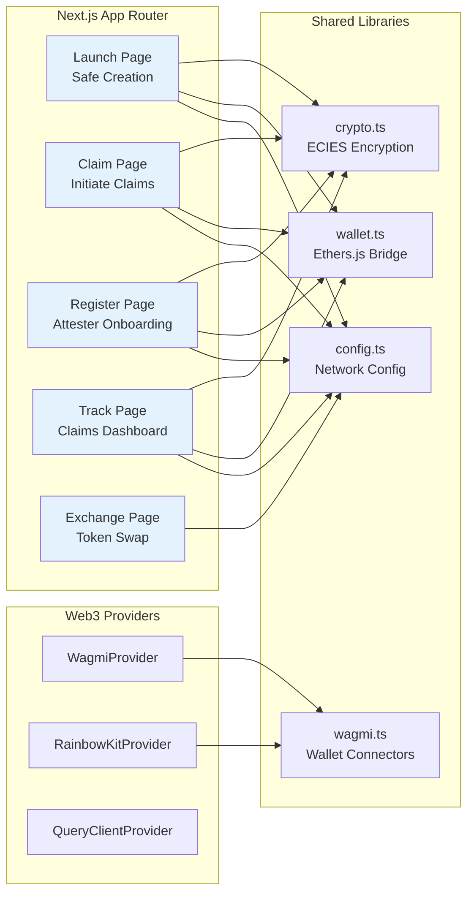
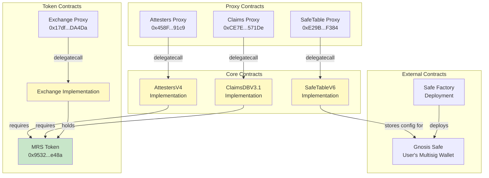
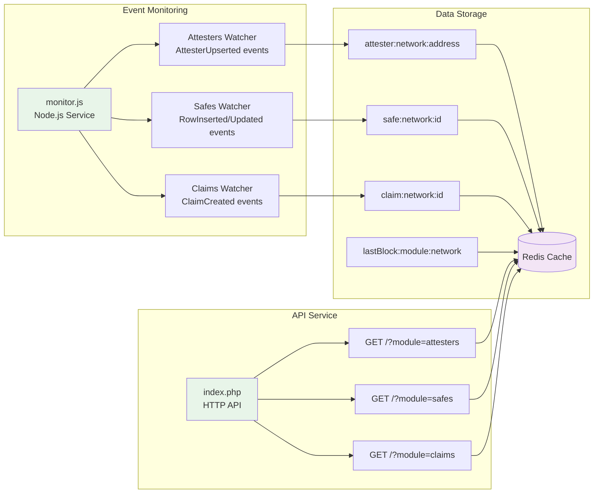
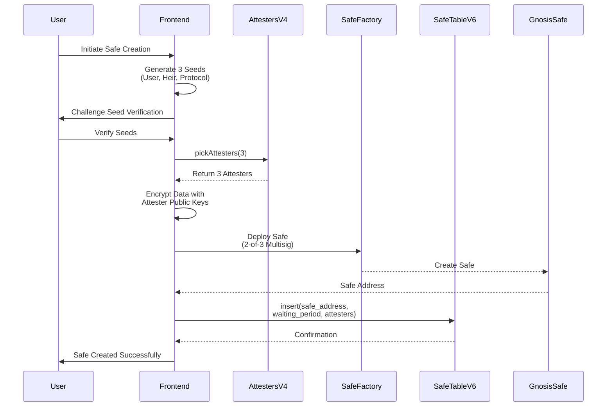
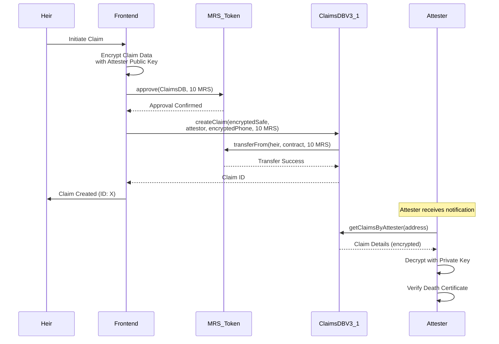
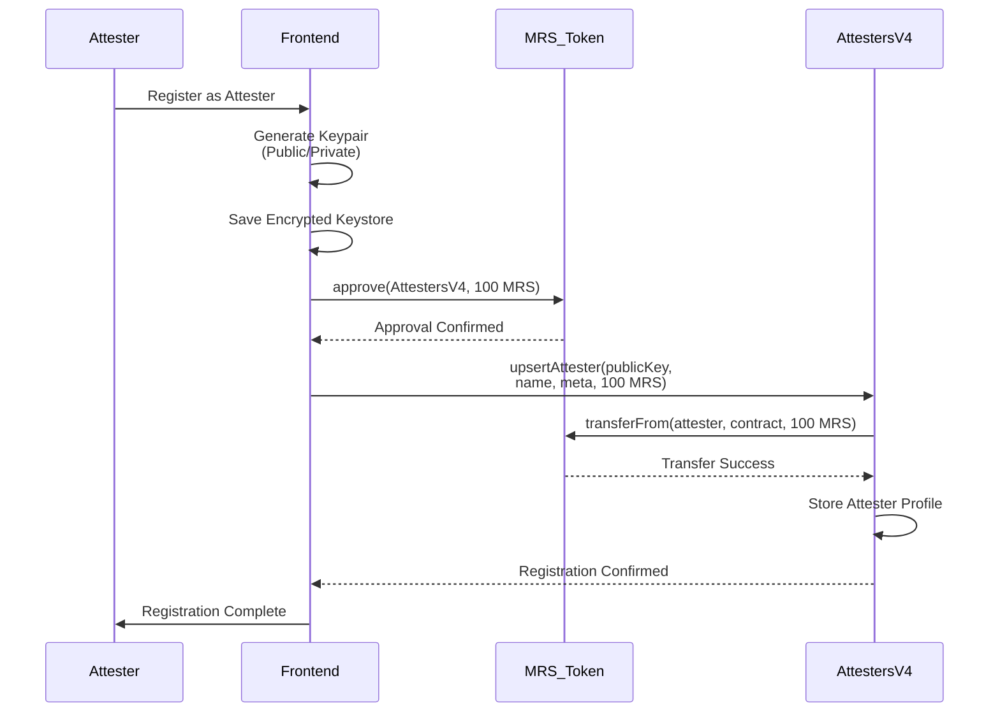
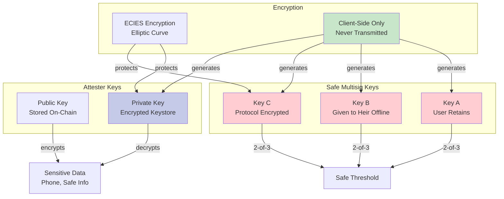
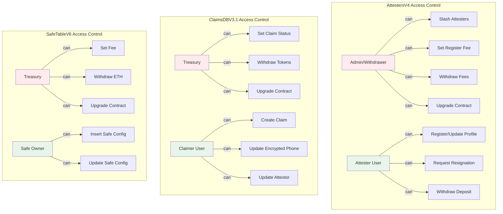
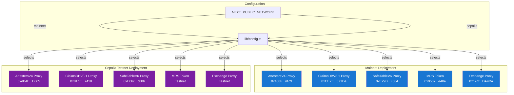

# Miras System Architecture

## Overview

Miras is a trustless, blockchain-based cryptocurrency inheritance system that enables secure transfer of digital assets to designated heirs without relying on custodians or intermediaries. The system operates on Ethereum (Mainnet and Sepolia testnet) and provides a complete solution for estate planning in the crypto ecosystem.

## High-Level Architecture

## Component Architecture

### 1. Frontend Layer (Next.js Application)

The frontend is built with Next.js 14 and provides user-facing interfaces for all protocol interactions.

**Key Components:**

- **Launch Page**: Handles Safe wallet creation, seed generation, and attester selection
- **Claim Page**: Enables heirs to initiate inheritance claims
- **Register Page**: Attester onboarding and staking interface
- **Track Page**: Allows attesters to view and manage assigned claims
- **Exchange Page**: Fixed-rate token exchange (10 MRS = 1 ETH)

**Shared Libraries:**

- **config.ts**: Centralized network configuration with contract addresses
- **wallet.ts**: Bridges Wagmi wallet clients to Ethers.js signers
- **crypto.ts**: ECIES encryption/decryption utilities
- **wagmi.ts**: Wallet connector configuration

### 2. Smart Contract Layer

The smart contract layer implements the core protocol logic using UUPS upgradeable patterns.

**Contract Relationships:**

- **Proxy Pattern**: All core contracts use UUPS (Universal Upgradeable Proxy Standard)
- **Token Dependencies**: AttestersV4 and ClaimsDBV3.1 require MRS token for fees
- **Safe Integration**: SafeTableV6 stores configuration for Gnosis Safe wallets

### 3. Backend Services Layer

The backend services provide event indexing and data caching for improved frontend performance.

**Backend Components:**

- **monitor.js**: Listens to blockchain events and indexes data into Redis
- **index.php**: Provides HTTP API for querying cached blockchain data
- **Redis**: Fast key-value store for indexed blockchain data

## Data Flow Architecture

### Safe Creation Flow

### Claim Initiation Flow

### Attester Registration Flow

## Security Architecture

### Cryptographic Key Management

**Security Principles:**

1. **No Single Point of Failure**: 2-of-3 multisig ensures no single party can access funds
2. **Client-Side Encryption**: All private keys generated in browser, never transmitted
3. **Decentralized Verification**: Randomly selected, staked attesters confirm user status
4. **Privacy**: Sensitive information encrypted with attester public keys before on-chain storage
5. **Economic Security**: Attesters stake 100 MRS tokens, subject to slashing for misbehavior

### Access Control Architecture

## Network Architecture

### Deployment Architecture

## Technology Stack

### Frontend Stack

- **Framework**: Next.js 14 (React 18, TypeScript)
- **Web3 Integration**: Wagmi, RainbowKit, Ethers.js
- **Wallet Support**: MetaMask, WalletConnect, Coinbase Wallet, etc.
- **Encryption**: ECIES (Elliptic Curve Integrated Encryption Scheme)
- **Styling**: Tailwind CSS (inferred from modern Next.js setup)

### Smart Contract Stack

- **Language**: Solidity 0.8.24
- **Upgradeability**: UUPS (Universal Upgradeable Proxy Standard)
- **Standards**: ERC-20 (MRS Token), EIP-2612 (Permit), ERC-1967 (Proxy)
- **External Dependencies**: OpenZeppelin contracts, Gnosis Safe

### Backend Stack

- **Event Monitoring**: Node.js with Ethers.js
- **API**: PHP
- **Cache**: Redis
- **RPC**: WebSocket connections to Ethereum nodes (Infura)

## Scalability Considerations

### Current Architecture

- **On-Chain Storage**: Minimal data stored on-chain (addresses, encrypted blobs)
- **Off-Chain Indexing**: Redis cache for fast queries
- **Event-Driven**: Backend monitors events and updates cache asynchronously

### Future Enhancements

- **Layer 2 Integration**: Deploy to Optimism, Arbitrum, or other L2s for lower fees
- **IPFS Storage**: Store large encrypted data on IPFS, reference hashes on-chain
- **Subgraph**: Use The Graph protocol for more sophisticated queries
- **Multi-Chain**: Support multiple EVM-compatible chains

## Conclusion

The Miras architecture is designed with security, decentralization, and user privacy as core principles. The three-layer architecture (Frontend, Blockchain, Backend) provides a robust foundation for trustless cryptocurrency inheritance, with clear separation of concerns and upgradeable smart contracts for future improvements.
