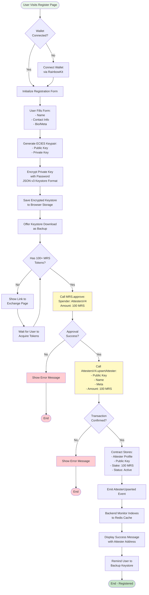
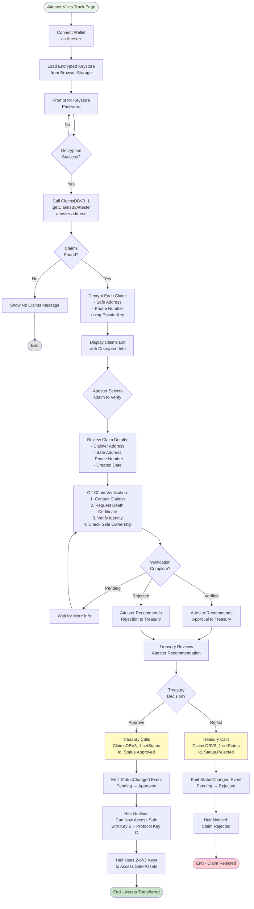
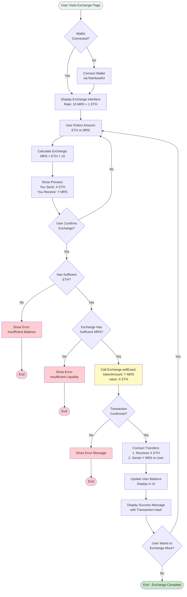
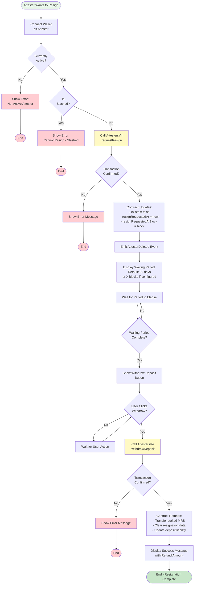
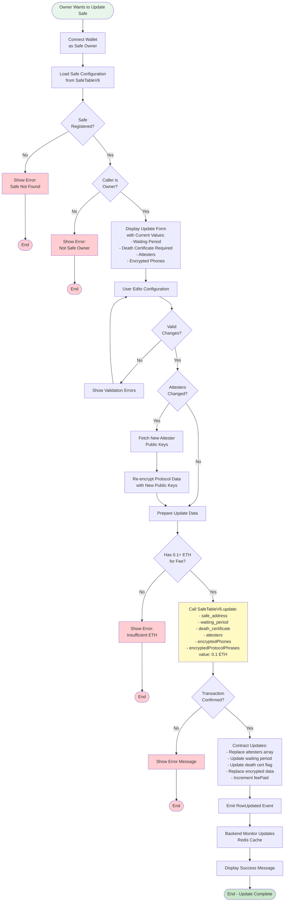

# Miras Process Flowcharts

This document contains detailed flowcharts for all major processes in the Miras inheritance system.

## Table of Contents

1. [Safe Creation and Setup Flow](#safe-creation-and-setup-flow)
2. [Attester Registration Flow](#attester-registration-flow)
3. [Claim Initiation Flow](#claim-initiation-flow)
4. [Claim Verification Flow](#claim-verification-flow)
5. [Token Exchange Flow](#token-exchange-flow)
6. [Attester Resignation Flow](#attester-resignation-flow)
7. [Safe Configuration Update Flow](#safe-configuration-update-flow)
8. [Backend Event Monitoring Flow](#backend-event-monitoring-flow)

---

## Safe Creation and Setup Flow

This is the primary flow for asset owners to set up their inheritance plan by creating a Gnosis Safe wallet and registering it with Miras.

```mermaid
flowchart TD
    START([User Visits Launch Page]) --> CHECK_WALLET{Wallet<br/>Connected?}
    CHECK_WALLET -->|No| CONNECT[Connect Wallet<br/>via RainbowKit]
    CHECK_WALLET -->|Yes| INIT_SETUP
    CONNECT --> INIT_SETUP[Initialize Safe Setup]
    
    INIT_SETUP --> GEN_SEEDS[Generate 3 Seeds:<br/>1. User Seed<br/>2. Heir Seed<br/>3. Protocol Seed]
    GEN_SEEDS --> DERIVE_KEYS[Derive Keys from Seeds:<br/>Key A User<br/>Key B Heir<br/>Key C Protocol]
    
    DERIVE_KEYS --> SHOW_SEEDS[Display Seeds to User<br/>with Warning]
    SHOW_SEEDS --> USER_SAVES{User Confirms<br/>Saved Seeds?}
    USER_SAVES -->|No| SHOW_SEEDS
    USER_SAVES -->|Yes| CHALLENGE[Seed Verification Challenge:<br/>Enter Random Words]
    
    CHALLENGE --> VERIFY{Verification<br/>Correct?}
    VERIFY -->|No| CHALLENGE
    VERIFY -->|Yes| FETCH_ATTESTERS[Call AttestersV4.pickAttesters<br/>to get 3 random attesters]
    
    FETCH_ATTESTERS --> GET_PUBKEYS[Retrieve Public Keys<br/>for Selected Attesters]
    GET_PUBKEYS --> ENCRYPT_DATA[Encrypt Protocol Data:<br/>- Protocol Seed<br/>- Heir Contact Info<br/>with each Attester's Public Key]
    
    ENCRYPT_DATA --> DEPLOY_SAFE[Deploy Gnosis Safe:<br/>Owners: Key A, Key B, Key C<br/>Threshold: 2 of 3]
    DEPLOY_SAFE --> SAFE_DEPLOYED{Safe<br/>Deployed?}
    SAFE_DEPLOYED -->|No| ERROR1[Show Error Message]
    ERROR1 --> END1([End])
    
    SAFE_DEPLOYED -->|Yes| GET_SAFE_ADDR[Get Safe Address]
    GET_SAFE_ADDR --> REGISTER_SAFE[Call SafeTableV6.insert:<br/>- Safe Address<br/>- Waiting Period<br/>- Death Certificate Required<br/>- Attesters Array<br/>- Encrypted Phones<br/>- Encrypted Protocol Phrases<br/>Pay 0.1 ETH Fee]
    
    REGISTER_SAFE --> REGISTERED{Registration<br/>Success?}
    REGISTERED -->|No| ERROR2[Show Error Message]
    ERROR2 --> END2([End])
    
    REGISTERED -->|Yes| SAVE_LOCAL[Save Configuration Locally:<br/>- Safe Address<br/>- User Seed encrypted<br/>- Heir Seed for offline kit]
    SAVE_LOCAL --> SHOW_SUCCESS[Display Success Message<br/>with Safe Address]
    SHOW_SUCCESS --> OFFER_HEIR_KIT[Offer to Download<br/>Heir Readiness Kit]
    OFFER_HEIR_KIT --> END3([End - Safe Created])
    
    style START fill:#e8f5e9
    style END1 fill:#ffcdd2
    style END2 fill:#ffcdd2
    style END3 fill:#c8e6c9
    style ERROR1 fill:#ffcdd2
    style ERROR2 fill:#ffcdd2
    style DEPLOY_SAFE fill:#fff9c4
    style REGISTER_SAFE fill:#fff9c4
```

**Key Steps:**

1. **Seed Generation**: Three BIP39 mnemonic seeds are generated client-side
2. **Verification Challenge**: User must prove they saved seeds by entering random words
3. **Attester Selection**: Smart contract randomly selects 3 active attesters
4. **Data Encryption**: Protocol data encrypted with each attester's public key
5. **Safe Deployment**: 2-of-3 multisig wallet deployed via Gnosis Safe Factory
6. **Registration**: Safe configuration stored on-chain in SafeTableV6

---

## Attester Registration Flow

This flow allows third-party verifiers to register as attesters by staking MRS tokens.

**Key Steps:**

1. **Keypair Generation**: ECIES public/private keypair generated client-side
2. **Keystore Encryption**: Private key encrypted with password (Ethereum JSON v3 format)
3. **Token Approval**: User approves AttestersV4 contract to spend 100 MRS
4. **Registration**: Contract stores attester profile and stakes tokens
5. **Indexing**: Backend monitor indexes new attester to Redis cache

---

## Claim Initiation Flow

This flow enables heirs to initiate an inheritance claim after the asset owner's death.

```mermaid
flowchart TD
    START([Heir Visits Claim Page]) --> CHECK_WALLET{Wallet<br/>Connected?}
    CHECK_WALLET -->|No| CONNECT[Connect Wallet<br/>via RainbowKit]
    CHECK_WALLET -->|Yes| INIT_CLAIM
    CONNECT --> INIT_CLAIM[Initialize Claim Form]
    
    INIT_CLAIM --> FILL_FORM[Heir Fills Form:<br/>- Safe Address encrypted<br/>- Contact Phone<br/>- Death Certificate Info]
    
    FILL_FORM --> FETCH_SAFE[Query SafeTableV6<br/>for Safe Configuration]
    FETCH_SAFE --> SAFE_EXISTS{Safe<br/>Registered?}
    SAFE_EXISTS -->|No| ERROR1[Show Error:<br/>Safe Not Found]
    ERROR1 --> END1([End])
    
    SAFE_EXISTS -->|Yes| GET_ATTESTERS[Get Attesters from<br/>Safe Configuration]
    GET_ATTESTERS --> SELECT_ATTESTER[Select Primary Attester<br/>from List]
    SELECT_ATTESTER --> GET_PUBKEY[Retrieve Attester's<br/>Public Key]
    
    GET_PUBKEY --> ENCRYPT_SAFE[Encrypt Safe Address<br/>with Attester's Public Key]
    ENCRYPT_SAFE --> ENCRYPT_PHONE[Encrypt Phone Number<br/>with Attester's Public Key]
    
    ENCRYPT_PHONE --> CHECK_BALANCE{Has 10+ MRS<br/>Tokens?}
    CHECK_BALANCE -->|No| SHOW_EXCHANGE[Show Link to<br/>Exchange Page]
    SHOW_EXCHANGE --> WAIT_TOKENS[Wait for User to<br/>Acquire Tokens]
    WAIT_TOKENS --> CHECK_BALANCE
    
    CHECK_BALANCE -->|Yes| APPROVE_TOKENS[Call MRS.approve:<br/>Spender: ClaimsDBV3_1<br/>Amount: 10 MRS]
    APPROVE_TOKENS --> APPROVED{Approval<br/>Success?}
    APPROVED -->|No| ERROR2[Show Error Message]
    ERROR2 --> END2([End])
    
    APPROVED -->|Yes| CREATE_CLAIM[Call ClaimsDBV3_1.createClaim:<br/>- encryptedSafe<br/>- attestor address<br/>- encryptedPhone<br/>- amount: 10 MRS]
    
    CREATE_CLAIM --> TX_CONFIRMED{Transaction<br/>Confirmed?}
    TX_CONFIRMED -->|No| ERROR3[Show Error Message]
    ERROR3 --> END3([End])
    
    TX_CONFIRMED -->|Yes| GET_CLAIM_ID[Get Claim ID<br/>from Transaction Receipt]
    GET_CLAIM_ID --> EMIT_EVENT[Emit ClaimCreated Event]
    EMIT_EVENT --> BACKEND_INDEX[Backend Monitor Indexes<br/>to Redis Cache]
    BACKEND_INDEX --> NOTIFY_ATTESTER[Attester Can Now View<br/>Claim in Track Page]
    NOTIFY_ATTESTER --> SHOW_SUCCESS[Display Success Message<br/>with Claim ID]
    SHOW_SUCCESS --> SHOW_TRACKING[Show Tracking Link<br/>for Claim Status]
    SHOW_TRACKING --> END4([End - Claim Created])
    
    style START fill:#e8f5e9
    style END1 fill:#ffcdd2
    style END2 fill:#ffcdd2
    style END3 fill:#ffcdd2
    style END4 fill:#c8e6c9
    style ERROR1 fill:#ffcdd2
    style ERROR2 fill:#ffcdd2
    style ERROR3 fill:#ffcdd2
    style APPROVE_TOKENS fill:#fff9c4
    style CREATE_CLAIM fill:#fff9c4
```

**Key Steps:**

1. **Safe Lookup**: Verify safe is registered in SafeTableV6
2. **Attester Selection**: Choose primary attester from safe configuration
3. **Data Encryption**: Encrypt safe address and phone with attester's public key
4. **Token Payment**: Approve and transfer 10 MRS tokens as claim fee
5. **Claim Creation**: Store encrypted claim data on-chain with Pending status

---

## Claim Verification Flow

This flow describes how attesters verify claims and how the protocol processes them.

**Key Steps:**

1. **Keystore Decryption**: Attester unlocks private key with password
2. **Claim Retrieval**: Fetch all claims assigned to attester
3. **Data Decryption**: Decrypt safe address and phone with private key
4. **Off-Chain Verification**: Attester contacts claimer and verifies death certificate
5. **Status Update**: Treasury updates claim status based on verification
6. **Asset Access**: Approved claims allow heir to access safe with 2-of-3 keys

---

## Token Exchange Flow

This flow allows users to exchange ETH for MRS tokens at a fixed rate.

**Key Steps:**

1. **Rate Calculation**: Fixed rate of 10 MRS per 1 ETH
2. **Balance Check**: Verify user has sufficient ETH
3. **Liquidity Check**: Verify exchange contract has sufficient MRS
4. **Token Swap**: User sends ETH, receives MRS tokens
5. **Balance Update**: UI reflects new token balance

---

## Attester Resignation Flow

This flow allows attesters to resign and withdraw their staked tokens after a waiting period.

**Key Steps:**

1. **Resignation Request**: Attester calls requestResign, becomes inactive
2. **Waiting Period**: Default 30 days before withdrawal allowed
3. **Deposit Withdrawal**: After waiting period, attester can withdraw staked tokens
4. **Refund**: Contract transfers staked MRS back to attester

---

## Safe Configuration Update Flow

This flow allows safe owners to update their inheritance configuration.

**Key Steps:**

1. **Ownership Verification**: Confirm caller is safe owner
2. **Configuration Edit**: User modifies waiting period, attesters, or requirements
3. **Re-encryption**: If attesters changed, re-encrypt data with new public keys
4. **Fee Payment**: Pay 0.1 ETH update fee
5. **On-Chain Update**: Contract updates safe configuration

---

## Backend Event Monitoring Flow

This flow describes how the backend service monitors blockchain events and indexes data.

```mermaid
flowchart TD
    START([Monitor Service Starts]) --> LOAD_CONFIG[Load Configuration:<br/>- RPC WebSocket URLs<br/>- Contract Addresses<br/>- Redis Connection<br/>- Confirmations: 5]
    
    LOAD_CONFIG --> CONNECT_REDIS[Connect to Redis Cache]
    CONNECT_REDIS --> REDIS_OK{Redis<br/>Connected?}
    REDIS_OK -->|No| ERROR1[Log Error and Retry]
    ERROR1 --> CONNECT_REDIS
    
    REDIS_OK -->|Yes| CONNECT_RPC[Connect to Ethereum<br/>WebSocket RPC]
    CONNECT_RPC --> RPC_OK{RPC<br/>Connected?}
    RPC_OK -->|No| ERROR2[Log Error and Retry]
    ERROR2 --> CONNECT_RPC
    
    RPC_OK -->|Yes| INIT_WATCHERS[Initialize 3 Watchers:<br/>1. Attesters Watcher<br/>2. Safes Watcher<br/>3. Claims Watcher]
    
    INIT_WATCHERS --> LOAD_LAST_BLOCK[Load Last Processed Block<br/>from Redis for Each Module]
    LOAD_LAST_BLOCK --> START_WATCHING[Start Watching Events<br/>from Last Block + 1]
    
    START_WATCHING --> LISTEN[Listen for New Blocks]
    LISTEN --> NEW_BLOCK{New Block<br/>Received?}
    NEW_BLOCK -->|No| LISTEN
    
    NEW_BLOCK -->|Yes| CHECK_CONFIRMS{Block Has<br/>5 Confirmations?}
    CHECK_CONFIRMS -->|No| LISTEN
    
    CHECK_CONFIRMS -->|Yes| QUERY_EVENTS[Query Events in Block Range<br/>Using queryFilterChunked]
    
    QUERY_EVENTS --> ATTESTERS_EVENTS{AttesterUpserted<br/>Events?}
    ATTESTERS_EVENTS -->|Yes| PROCESS_ATTESTERS[Process Attester Events:<br/>- Parse event data<br/>- Store in Redis:<br/>  attester:network:address]
    ATTESTERS_EVENTS -->|No| SAFES_EVENTS
    PROCESS_ATTESTERS --> SAFES_EVENTS
    
    SAFES_EVENTS{RowInserted/<br/>RowUpdated<br/>Events?}
    SAFES_EVENTS -->|Yes| PROCESS_SAFES[Process Safe Events:<br/>- Parse event data<br/>- Store in Redis:<br/>  safe:network:address]
    SAFES_EVENTS -->|No| CLAIMS_EVENTS
    PROCESS_SAFES --> CLAIMS_EVENTS
    
    CLAIMS_EVENTS{ClaimCreated/<br/>StatusChanged<br/>Events?}
    CLAIMS_EVENTS -->|Yes| PROCESS_CLAIMS[Process Claim Events:<br/>- Parse event data<br/>- Store in Redis:<br/>  claim:network:id]
    CLAIMS_EVENTS -->|No| UPDATE_BLOCK
    PROCESS_CLAIMS --> UPDATE_BLOCK
    
    UPDATE_BLOCK[Update Last Processed Block<br/>in Redis for Each Module]
    UPDATE_BLOCK --> LOG_PROGRESS[Log Processing Progress]
    LOG_PROGRESS --> LISTEN
    
    LISTEN --> DISCONNECT{Connection<br/>Lost?}
    DISCONNECT -->|Yes| RECONNECT[Attempt Reconnection]
    RECONNECT --> CONNECT_RPC
    DISCONNECT -->|No| LISTEN
    
    style START fill:#e8f5e9
    style PROCESS_ATTESTERS fill:#fff9c4
    style PROCESS_SAFES fill:#fff9c4
    style PROCESS_CLAIMS fill:#fff9c4
    style ERROR1 fill:#ffcdd2
    style ERROR2 fill:#ffcdd2
```

**Key Steps:**

1. **Initialization**: Connect to Redis and Ethereum RPC
2. **Last Block Recovery**: Load last processed block from Redis for stateful resumption
3. **Event Listening**: Monitor new blocks with 5 confirmations
4. **Event Processing**: Parse and index events into Redis with structured keys
5. **Progress Tracking**: Update last processed block after each batch

**Redis Key Patterns:**

- `attester:{network}:{address}` - Attester profile data
- `safe:{network}:{address}` - Safe configuration data
- `claim:{network}:{id}` - Claim record data
- `lastBlock:{module}:{network}` - Last processed block number

---

## Summary

These flowcharts provide comprehensive documentation of all major processes in the Miras inheritance system. Each flow includes:

- **Decision Points**: Clear branching logic for different scenarios
- **Error Handling**: Explicit error states and recovery paths
- **Smart Contract Interactions**: Highlighted contract calls
- **Data Flow**: Encryption, storage, and retrieval patterns
- **User Experience**: Step-by-step user journeys

The flowcharts serve as both technical documentation for developers and process documentation for understanding the system's operation.
