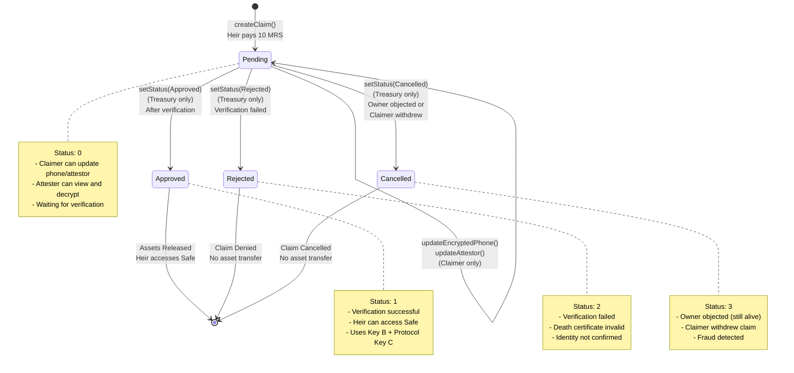
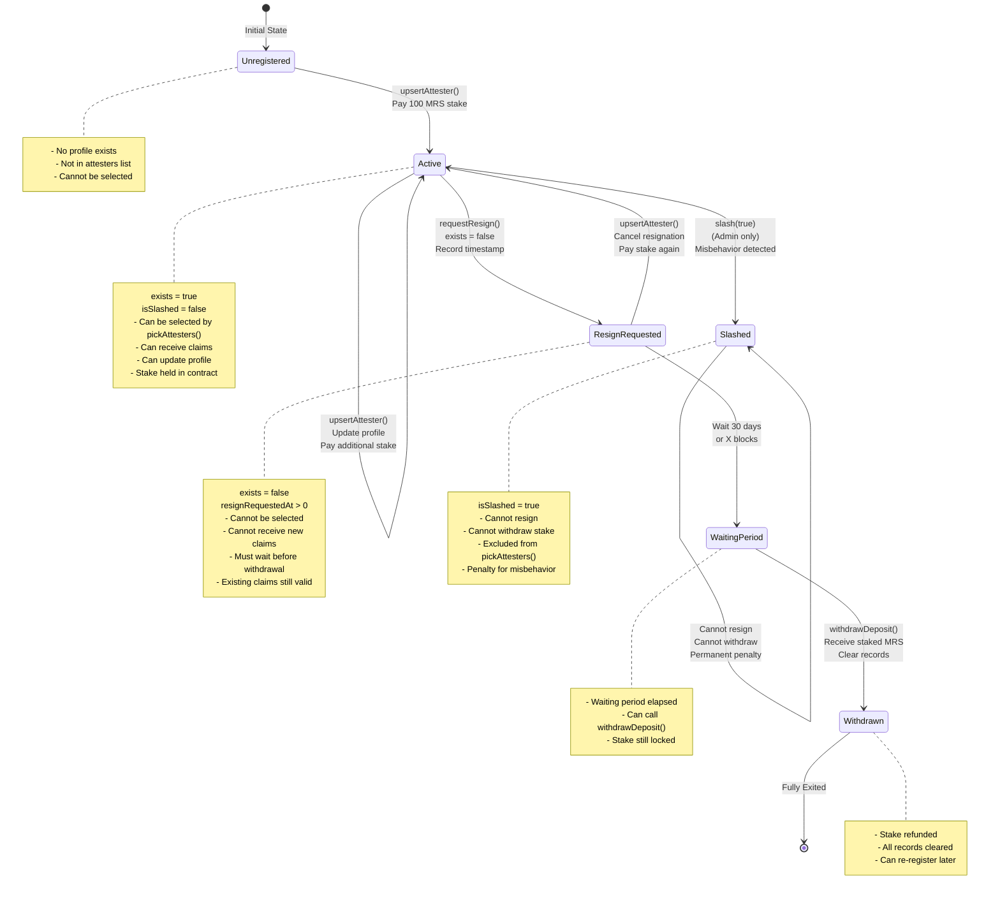
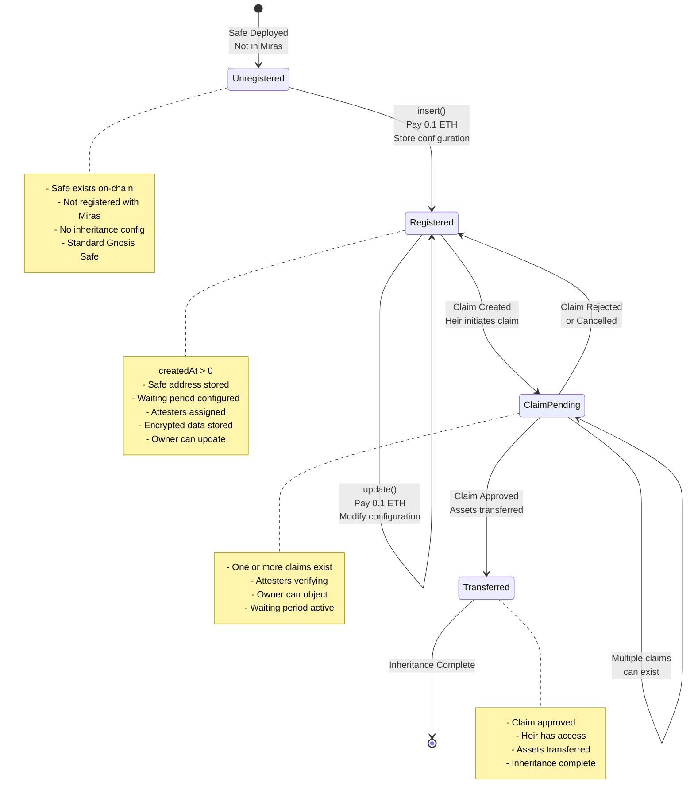
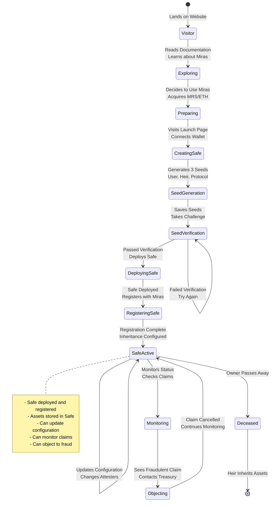
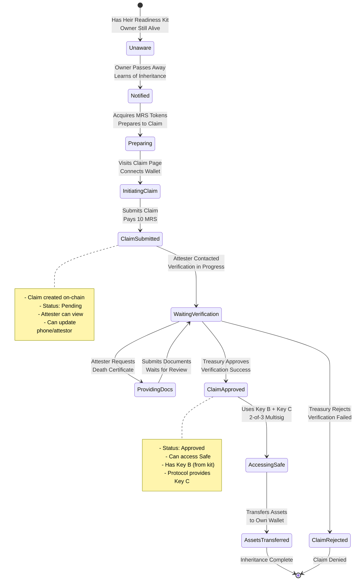
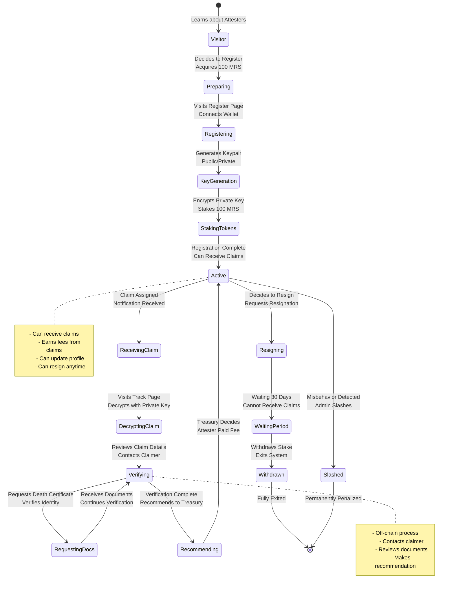
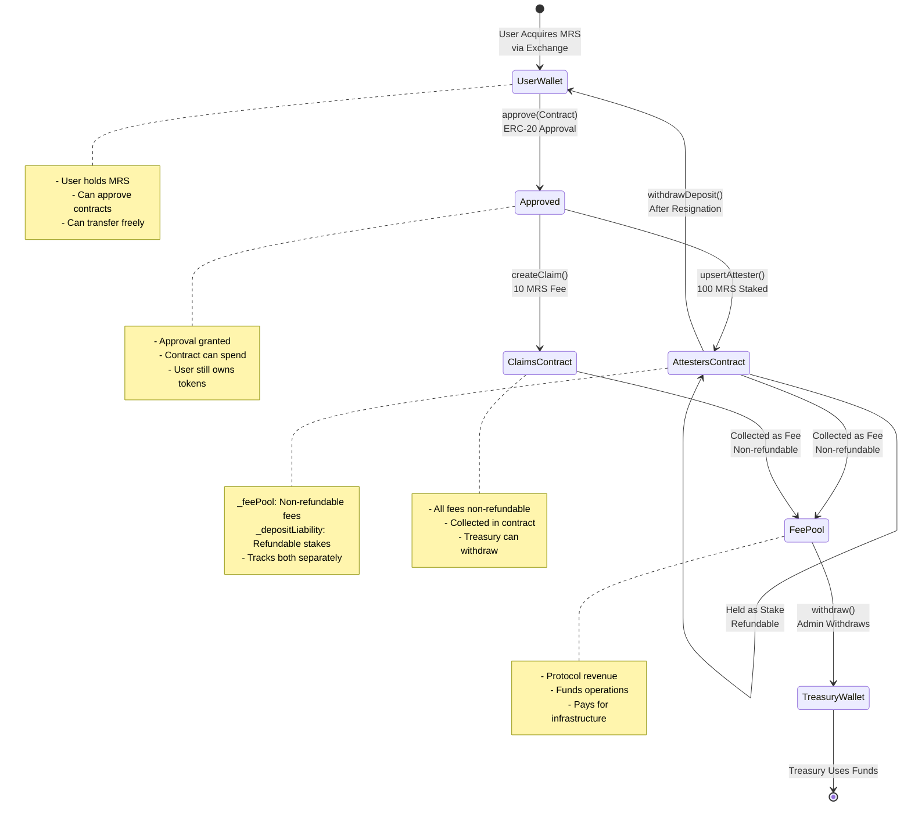

# Miras State Diagrams

This document contains state transition diagrams for all stateful entities in the Miras inheritance system.

## Table of Contents

1. [Claim Status State Machine](#claim-status-state-machine)
2. [Attester Lifecycle States](#attester-lifecycle-states)
3. [Safe Configuration States](#safe-configuration-states)
4. [User Journey States](#user-journey-states)
5. [Token Flow States](#token-flow-states)

---

## Claim Status State Machine

The claim status represents the lifecycle of an inheritance claim from creation to final resolution.

**State Definitions:**

- **Pending (0)**: Initial state after claim creation. Claimer can modify encrypted phone and attestor. Attester performs verification.
- **Approved (1)**: Treasury approved claim after successful verification. Heir can now access Safe assets using 2-of-3 keys.
- **Rejected (2)**: Treasury rejected claim due to failed verification, invalid death certificate, or identity issues.
- **Cancelled (3)**: Claim cancelled because owner objected (proving they're alive) or claimer withdrew.

**Transitions:**

- `createClaim()`: Heir initiates claim, pays 10 MRS fee → **Pending**
- `updateEncryptedPhone()`: Claimer updates contact info (only in **Pending**)
- `updateAttestor()`: Claimer changes designated attester (only in **Pending**)
- `setStatus(Approved)`: Treasury approves after verification → **Approved**
- `setStatus(Rejected)`: Treasury rejects after verification → **Rejected**
- `setStatus(Cancelled)`: Treasury cancels due to objection → **Cancelled**

**Access Control:**

- **Claimer**: Can update phone/attestor only in Pending state
- **Treasury**: Can change status from Pending to any final state
- **Attester**: Read-only access to decrypt and verify

---

## Attester Lifecycle States

The attester lifecycle tracks the registration, activity, resignation, and withdrawal process.

**State Definitions:**

- **Unregistered**: No attester profile exists for this address
- **Active**: Registered attester with `exists = true`, can receive claims
- **ResignRequested**: Attester requested resignation, `exists = false`, waiting period started
- **WaitingPeriod**: Resignation waiting period (30 days) elapsed, can withdraw
- **Slashed**: Attester penalized for misbehavior, cannot withdraw stake
- **Withdrawn**: Stake refunded, attester fully exited

**Transitions:**

- `upsertAttester()`: Register or update profile, pay stake → **Active**
- `requestResign()`: Request resignation, become inactive → **ResignRequested**
- `slash(true)`: Admin penalizes attester → **Slashed**
- `withdrawDeposit()`: After waiting period, withdraw stake → **Withdrawn**

**Key Properties:**

- **exists**: Boolean indicating if attester is active
- **isSlashed**: Boolean indicating if attester is penalized
- **resignRequestedAt**: Timestamp when resignation was requested
- **refundableDeposit**: Amount of staked MRS that can be withdrawn

---

## Safe Configuration States

The safe configuration tracks the lifecycle of a registered Safe wallet in the Miras system.

**State Definitions:**

- **Unregistered**: Safe deployed but not registered with Miras
- **Registered**: Safe configuration stored on-chain, no active claims
- **ClaimPending**: One or more inheritance claims exist for this Safe
- **Transferred**: Claim approved, assets transferred to heir

**Transitions:**

- `insert()`: Register Safe with Miras, pay 0.1 ETH → **Registered**
- `update()`: Modify Safe configuration, pay 0.1 ETH → **Registered**
- `createClaim()`: Heir initiates claim → **ClaimPending**
- `setStatus(Approved)`: Treasury approves claim → **Transferred**
- `setStatus(Rejected/Cancelled)`: Treasury rejects claim → **Registered**

**Configuration Data:**

- **owner**: Address that registered the Safe
- **safe_address**: Gnosis Safe contract address
- **waiting_period**: Time before claim can be approved (e.g., 3 months)
- **death_certificate**: Boolean indicating if death certificate is required
- **attesters**: Array of 3 attester addresses
- **encryptedPhones**: Encrypted contact info for each attester
- **encryptedProtocolPhrases**: Encrypted protocol seed for each attester

---

## User Journey States

This diagram shows the overall user journey states for different user types in the Miras system.

### Asset Owner Journey

### Heir Journey

### Attester Journey

---

## Token Flow States

This diagram shows the state transitions for MRS tokens in the system.

**Token Flow Paths:**

1. **Attester Registration**: User → Approved → AttestersContract (100 MRS stake)
2. **Claim Creation**: User → Approved → ClaimsContract (10 MRS fee)
3. **Attester Resignation**: AttestersContract → UserWallet (refund stake)
4. **Fee Collection**: AttestersContract/ClaimsContract → FeePool → TreasuryWallet

**Key Concepts:**

- **Stake**: Refundable deposit held in AttestersV4 contract
- **Fee**: Non-refundable payment for protocol services
- **Deposit Liability**: Amount of staked tokens that must remain in contract
- **Fee Pool**: Accumulated fees available for treasury withdrawal

---

## State Transition Rules

### Claim Status Rules

| From State | To State | Trigger | Authorization | Conditions |
|------------|----------|---------|---------------|------------|
| N/A | Pending | `createClaim()` | Claimer | Pay 10 MRS fee |
| Pending | Pending | `updateEncryptedPhone()` | Claimer | Status must be Pending |
| Pending | Pending | `updateAttestor()` | Claimer | Status must be Pending |
| Pending | Approved | `setStatus(1)` | Treasury | Verification successful |
| Pending | Rejected | `setStatus(2)` | Treasury | Verification failed |
| Pending | Cancelled | `setStatus(3)` | Treasury | Owner objected or fraud |

### Attester Status Rules

| From State | To State | Trigger | Authorization | Conditions |
|------------|----------|---------|---------------|------------|
| Unregistered | Active | `upsertAttester()` | Attester | Pay 100 MRS stake |
| Active | Active | `upsertAttester()` | Attester | Update profile, pay stake |
| Active | ResignRequested | `requestResign()` | Attester | Not slashed |
| Active | Slashed | `slash(true)` | Admin | Misbehavior detected |
| ResignRequested | Active | `upsertAttester()` | Attester | Cancel resignation |
| ResignRequested | Withdrawn | `withdrawDeposit()` | Attester | Waiting period elapsed |

### Safe Configuration Rules

| From State | To State | Trigger | Authorization | Conditions |
|------------|----------|---------|---------------|------------|
| Unregistered | Registered | `insert()` | Owner | Pay 0.1 ETH fee |
| Registered | Registered | `update()` | Owner | Pay 0.1 ETH fee |
| Registered | ClaimPending | `createClaim()` | Heir | Safe must be registered |
| ClaimPending | Registered | `setStatus(2/3)` | Treasury | Claim rejected/cancelled |
| ClaimPending | Transferred | `setStatus(1)` | Treasury | Claim approved |

---

## State Invariants

### Claim Invariants

1. A claim can only be in one status at a time
2. Only Treasury can change claim status
3. Claimer can only modify Pending claims
4. Once a claim reaches a final state (Approved/Rejected/Cancelled), it cannot change

### Attester Invariants

1. An attester cannot be both Active and ResignRequested simultaneously
2. A slashed attester cannot withdraw their stake
3. Only active attesters (exists = true, isSlashed = false) can be selected by `pickAttesters()`
4. Resignation waiting period must elapse before withdrawal

### Safe Invariants

1. A Safe can only be registered once (createdAt > 0)
2. Only the owner can update Safe configuration
3. Multiple claims can exist for a single Safe
4. Safe configuration persists even after claims are resolved

### Token Invariants

1. Total contract balance ≥ deposit liability + fee pool
2. Deposit liability = sum of all refundable stakes
3. Fee pool = accumulated non-refundable fees
4. Treasury can only withdraw (balance - deposit liability)

---

## Conclusion

These state diagrams provide a comprehensive view of all stateful entities in the Miras system. Understanding these states and transitions is crucial for:

- **Developers**: Implementing correct state management logic
- **Auditors**: Verifying state transition security
- **Users**: Understanding their journey through the system
- **Operators**: Monitoring system health and detecting anomalies

Each state machine is designed with clear entry/exit conditions, authorization rules, and invariants to ensure system integrity and security.
